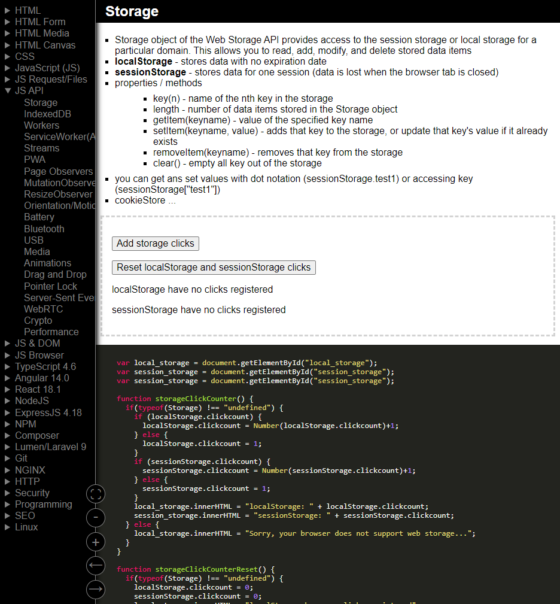
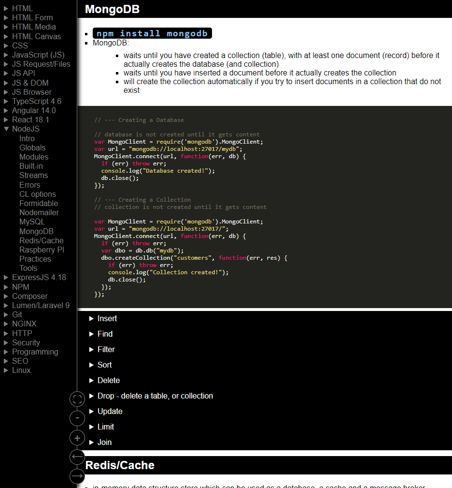
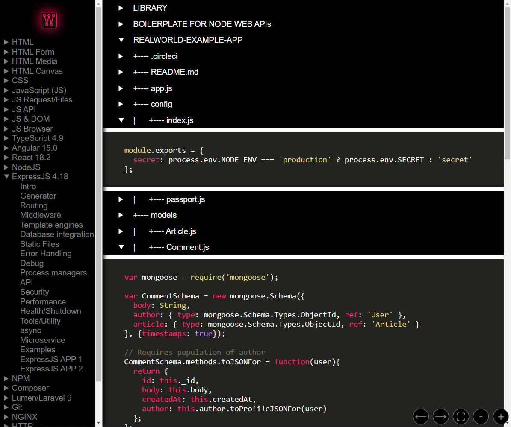

Web Engineer Book

https://book.vipsprojects.com/

- This book is a compilation of guides, examples, cheat sheets and recipes in area of web programming and related technologies
- It is a giveaway and give back to Open Source Community, feel free to contribute and share.
- Information provided here was found in following sources: https://www.w3schools.com/ , https://developer.mozilla.org/ , https://github.com/ , https://reactjs.org/ , https://angular.io/ , https://www.typescriptlang.org/ , https://nodejs.org/ , https://expressjs.com , https://www.php.net/ , https://laravel.com/ , tech blogs and different authors articles.
- Book serves best as a quick lookup and guide for solutions for users of any level, in some cases is a compact plain extract of main knowledge, in others, a composition from different sources, all accompanied with live examples, commented or whole apps code.
- Initially contents were copied in 2018-2019 with further updates based on upgrade guides, change logs, etc..
- This book uses basic web technologies, internally don't need an internet connection and can be copied to and viewed on any device with web browser, although for some examples it has to be located on a server with PHP.
- This book in some cases don't provide direct links as initially was unplanned to be released and created as additional learning task (thus most live examples and arrangement are crafted by author), if you found yourself author or owner of provided example or want to contribute, please send PR with additional markup or open an issue at GitHub: github.com/VipsProjects/WebEngineerBook
- All credits go to Open Source Community, respective authors and Andrei T. ( andreivinyl@gmail.com ). See LICENSE file for extended information.

This project is part of VipsProjects.com , please visit to support and explore.

